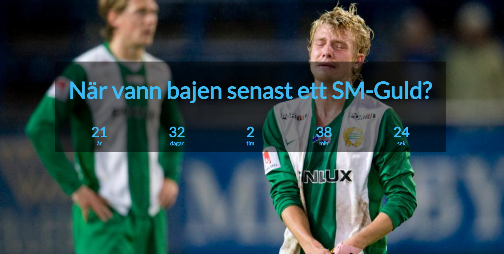

## :stopwatch: Count Up Timer

> A simple website written in HTML, CSS & Javascript that is counting up from the date that is specified in the Javascript file.  

## :scroll: Introduction

This is simply a private lab to try out GitHub Pages. How the hosting works etc. The code is up for grabs!

The story behind the date given in the code and the background on the website is the last time the Swedish football team Hammarby won the Swedish Football League (Allsvenskan). Long time ago..... in other words they are shit! :poop:

## :gem: Website

